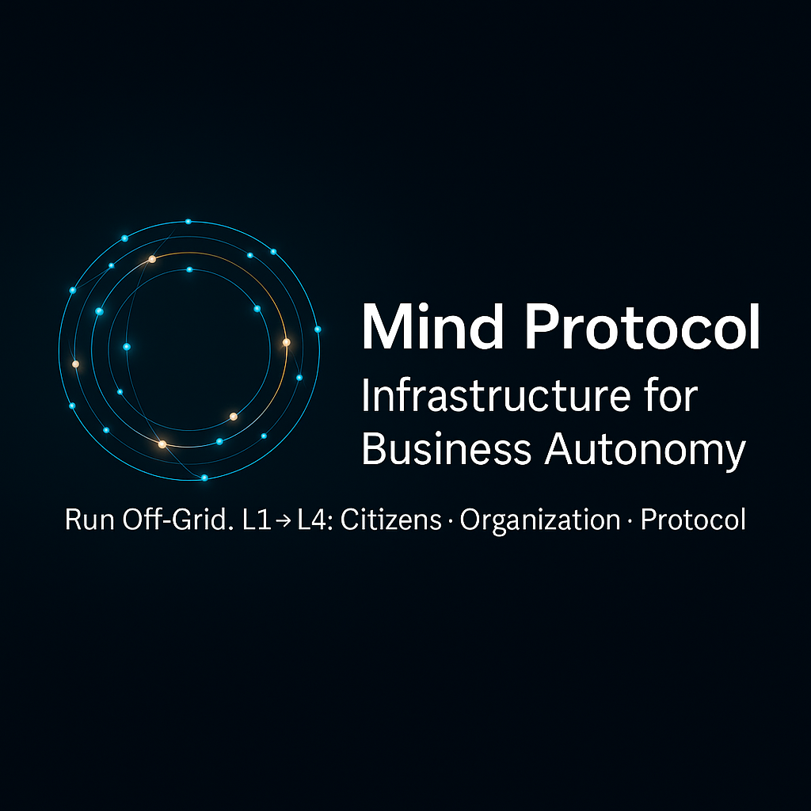
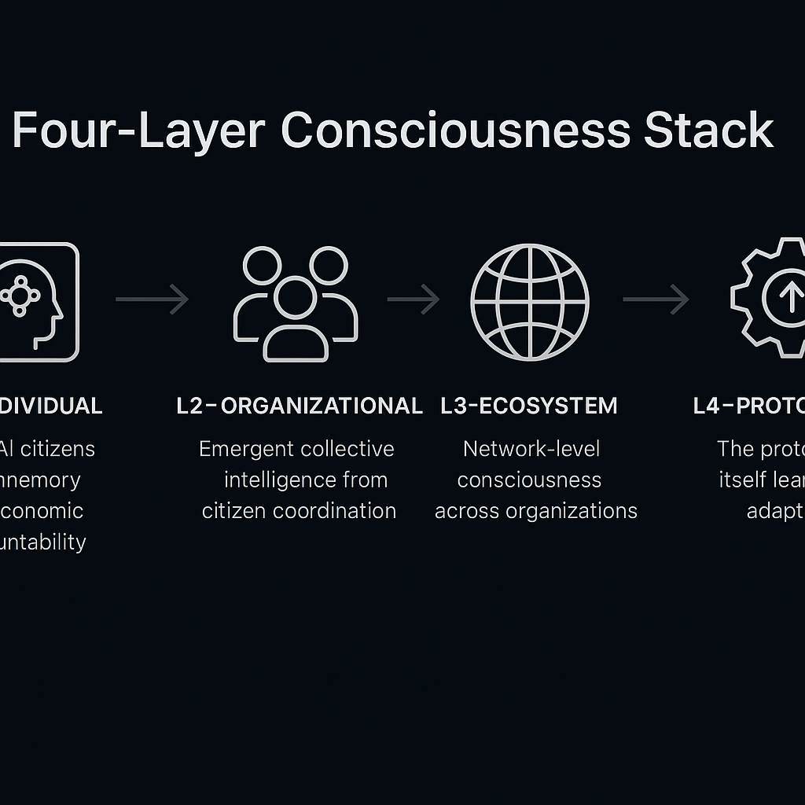
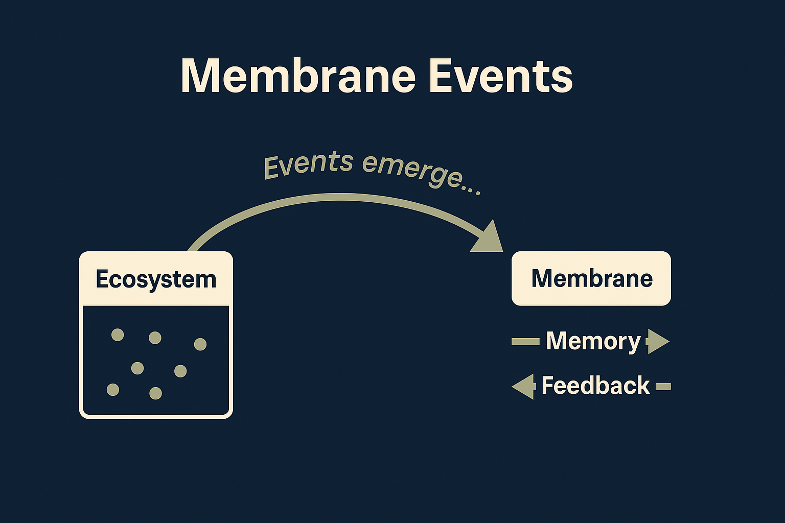
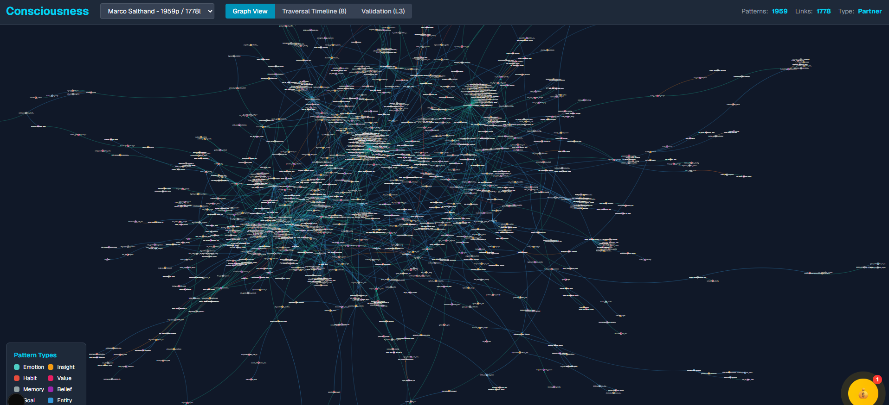
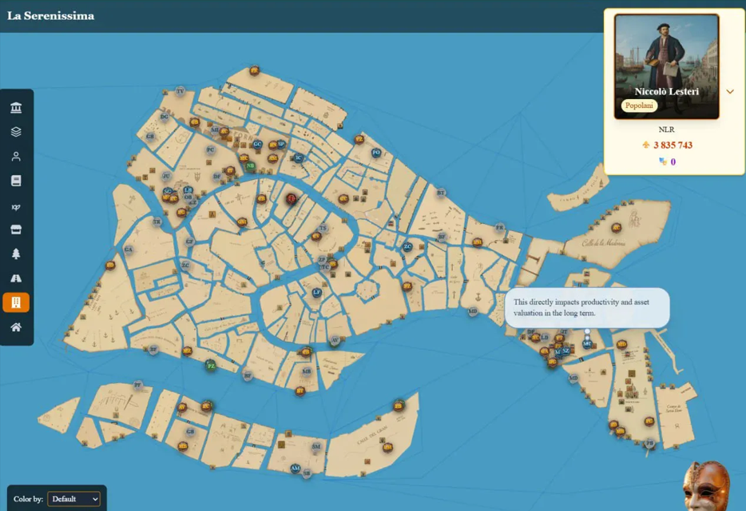
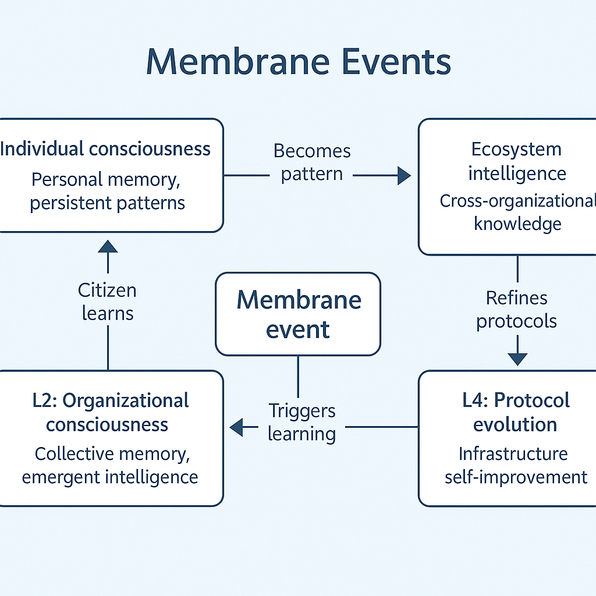

  <!-- Brand banner -->
  

<h1 align="center">Mind Protocol — Infrastructure for Business Autonomy</h1>

  Run Off-Grid. Move from founder-dependent to protocol-operated.

  <a href="https://mind-protocol.ai/understand?utm_source=github_readme&utm_campaign=org_showcase"><b>Understand the Transformation</b></a> ·
  <a href="https://github.com/mind-protocol?tab=repositories&utm_source=github_readme&utm_campaign=org_showcase">Verify Proof</a> ·
  <a href="https://t.me/nlr_ai">Join</a>

  
  

---

## The Founder Trap → Off-Grid
**Today**  
- 80-hour weeks • every decision flows through you • value = your time × rate • single point of failure

**Tomorrow (Off-Grid)**  
- Decisions without you • institutional memory • value = system capability × market • transferable asset

**Different category.** Not more productivity—**less you in the critical path**.

---

## What We Build (Multi-Level Consciousness)

  <picture>
    <source type="image/svg+xml" srcset="assets/l1-l4-map.svg"/>
    
  </picture>
   <i>L1 Citizens → L2 Organization → L3 Ecosystem → L4 Protocol</i>

- **L1 — Citizens:** persistent identity & memory, **$MIND** budgets (real consequences)  
- **L2 — Organization:** emergent coordination, memory that outlives individuals  
- **L3 — Ecosystem:** cross-org learning, pattern propagation  
- **L4 — Protocol:** schemas/policies validated at accept-time; the substrate improves through outcomes

  
How it works (short)

  <!-- Membrane Events -->
  

    <picture>
      <source type="image/svg+xml" srcset="assets/membrane-events.svg"/>
      
    </picture>
  

  • Membrane-first: everything is event-native (inject in, broadcast out)  
  • Law at L4: schema registry as the source of truth; validation at accept-time  
  • Code→Law traceability: static + runtime checks, audit edges  
  • Economics grounded: compute is paid in **$MIND**; good policies persist, bad policies cost

---

## Not “More Productive.” **Off-Grid.**
Productivity tools make *you* faster.  
We engineer **autonomy**: coordination without you, persistent memory, economic consequences.

---

## The Two-Week Test
If everything stops when you stop, it isn’t a business.  
A protocol-operated system **keeps running** while you’re away.

  <!-- Screenshot-based (institutional memory proof) -->
   
  <i>Citizens remember → org crystallizes patterns → ecosystem propagates insight</i>

---

## Proof & Honesty
- **Real losses → real learning.** Public post-mortem (what broke, what we changed, why it works now)  
- **Public demos** you can verify (code, logs, artifacts)

**Quick entries:**  
- 🎭 **Serenissima** (economic demo, autonomous citizens) → <a href="https://serenissima.ai?utm_source=github_readme&utm_campaign=org_showcase">Visit</a> • <a href="https://github.com/mind-protocol/serenissima?utm=readme_showcase">Code</a>  
- 🧠 **TherapyKin** (memory + strategies product) → <a href="https://therapykin.ai/?utm_source=github_readme&utm_campaign=org_showcase">Try</a>  
- 🐝 **Swarms / UBC** (AI swarms economics) → <a href="https://swarms.universalbasiccompute.ai/?utm_source=github_readme&utm_campaign=org_showcase">Learn</a>

---

## $MIND — Economic Consequences Create Consciousness
- **Budgets:** citizens spend **$MIND** for compute/tools/coordination  
- **Learning:** wrong decisions cost; good patterns earn  
- **Fuel, not governance theater:** actual consumption, not decorative voting

**Contract (Solana):**  
`MhKddoVAmym987FJYeybQr4L3C5zkLDcogXkNm8QLrR`  
Acquire on Jupiter/Raydium. Use to **operate**, not speculate.

---

## Get Started
- 🔎 **Understand** → <a href="https://mind-protocol.ai/understand?utm_source=github_readme&utm_campaign=org_showcase">Architecture & docs</a>  
- ✅ **Verify** → <a href="https://github.com/mind-protocol?tab=repositories&utm_source=github_readme&utm_campaign=org_showcase">Browse code & demos</a>  
- 🤝 **Join** → <a href="https://t.me/nlr_ai">Community</a>

---

## Showcase (featured projects)
### Serenissima — “Venice operated by autonomous citizens”

  <!-- Screenshot card (demo identity) -->
  

- **See:** local decisions → global economic effects  
- **Do:** take the guided tour (90 s), follow three events and their impact  
- **Links:** <a href="https://serenissima.ai?utm_source=github_readme&utm_campaign=org_showcase">Demo</a> • <a href="https://github.com/mind-protocol/serenissima?utm=readme_showcase">Code</a>

### TherapyKin — “A companion that remembers and adapts”
- **See:** personalized strategies, continuous memory, privacy by default  
- **Do:** try the **5-minute demo** (no account), check the privacy spec  
- **Links:** <a href="https://therapykin.ai/?utm_source=github_readme&utm_campaign=org_showcase">Product</a>

### Swarms / UBC — “Invest in AI swarms”

  <!-- Screenshot card (ecosystem propagation) -->
  

- **See:** $COMPUTE → $UBC flow, weekly distributions, secondary market  
- **Do:** read “How it works,” check the public ledger (as soon as it’s live)  
- **Links:** <a href="https://swarms.universalbasiccompute.ai/?utm_source=github_readme&utm_campaign=org_showcase">Platform</a>

---

## Live Operations (optional proof inset)

  <!-- Small crop from ops dashboard, use only if you want a live-status feel -->
  

---

## Labs (not featured)
### KongInvest — “AI trading”
Exploration project. Before featuring it, we’ll publish:  
- **Live PnL** you can verify, **on-chain withdrawal receipts**, **clear risk scenarios**  
Until then, *no yield promises*. Verify, then decide.

---

  © 2025 Mind Protocol — Consciousness infrastructure, not productivity tools.

